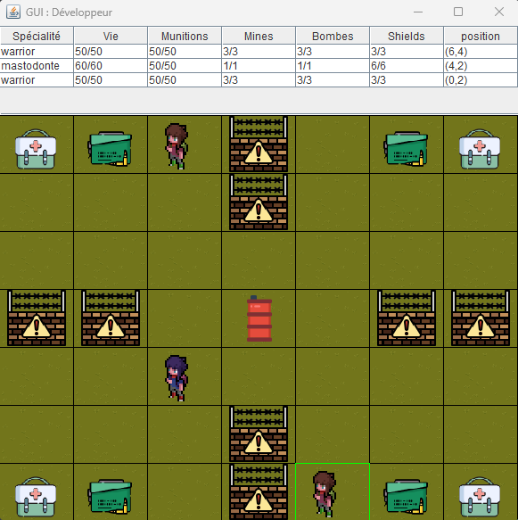

# Jeu de combat au tour par tour

## Description

Ce jeu est un projet universitaire fait en collaboration avec [Tom David](https://github.com/kitoutou999) et Emilien Huron.
Le but de ce projet était de mettre en place une architecture MVC robuste et d'intégrer diverses design patterns.
Parmis les patterns utilisés on retrouve le pattern observer, le pattern proxy, le pattern adaptater, le pattern factory method et la pattern strategy.

## Règles du jeu

Chaque joueur peut:
+ Se déplacer d'une case (haut, bas, gauche, droite).
+ Déposer une mine sur l'une des 8 cases adjacentes.
+ Déposer une bombe sur l'une des 8 cases adjacentes.
+ Utiliser le tir horizontal ou vertical.
+ Déclencher un bouclier, qui rend invincible pendant un tour.
+ Utiliser une hache (haut, bas, gauche, droite).
+ Passer son tour.

Lors de sa création, une grille peut contenir des murs, des kits de soins, des boîtes de
munitions et des barils explosifs. 

Par défaut une bombe explose au bout de trois tours.

Par défaut un tir horizontal ou vertical n’a pas de portée limitée.

Par défaut une mine n’est visible que par celui qui l’a posé.

## Contribuer

+ N'hésitez pas à signaler des bugs.

+ N'hésitez pas à améliorer le code existant.

## Licence

Ce projet est sous licence [MIT].

## Captures d'écran

## Crédits des images

|                                      image                                        |                                Auteur / Licence                                 |
|:---------------------------------------------------------------------------------:|:-------------------------------------------------------------------------------:|
|      |              [mine - Freepik](https://fontawesome.com/icons/)                   |
|  |              [health - Freepik](https://fontawesome.com/icons/)                 |
|  |              [barrel - Freepik](https://fontawesome.com/icons/)                 |
|      |              [wall - Freepik](https://fontawesome.com/icons/)                   |
|      |              [bomb - Freepik](https://fontawesome.com/icons/)                   |
|      |              [ammo - Freepik](https://fr.freepik.com/icone/munitions_3836821)   |
|  | [décor - Cupnooble](https://cupnooble.itch.io/sprout-lands-asset-pack?download) |
|      |   [héros vert - sscary.itch](https://sscary.itch.io/the-adventurer-male)        |
|  |   [héros violet - sscary.itch](https://sscary.itch.io/the-adventurer-male)      |
|      |   [héros bleu - sscary.itch](https://sscary.itch.io/the-adventurer-male)        |